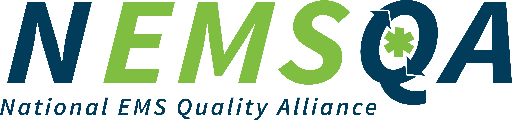

<!-- Title Page -->

  
# National EMS Quality Alliance  
## 2021 Respiratory-01 Measure Package

\newpage

<!-- Disclaimer Page -->

# Disclaimer

EMS Performance Measures (Measures) and related data specifications developed by the National EMS  
Quality Alliance (NEMSQA) are intended to facilitate quality improvement activities by EMS  
professionals.  
These measures are intended to assist EMS professionals in enhancing quality of care. These Measures are  
not clinical guidelines and do not establish a standard of medical care and have not been tested for all  
potential applications. NEMSQA encourages testing and evaluation of its Measures.  
Measures are subject to review and may be revised or rescinded at any time by NEMSQA. The measures  
may not be altered without prior written approval from NEMSQA. The measures, while copyrighted, can be  
reproduced and distributed, without modification, for noncommercial purposes (e.g., use by health care  
providers in connection with their practices). Commercial use is defined as the sale, license, or distribution  
of the measures for commercial gain, or incorporation of the measures into a product or service that is sold,  
licensed, or distributed for commercial gain. Commercial uses of the measures require a license agreement  
between the user and NEMSQA. Neither NEMSQA nor its members shall be responsible for any use of the  
measures.  
THESE MEASURES AND SPECIFICATIONS ARE PROVIDED “AS IS” WITHOUT WARRANTY OF  
ANY KIND.  
©2021 National EMS Quality Alliance. All rights reserved.  
Limited proprietary coding is contained in the measure specifications for convenience. Users of the  
proprietary coding sets should obtain all necessary licenses from the owners of these code sets.  
NEMSQA and its members disclaim all liability for use or accuracy of any Current Procedural Terminology  
(CPT®) or other coding contained in the specifications. ICD-10 copyright 2020 International Health  
Terminology Standards Development Organization.  
CPT ® is a registered trademark of the American Medical Association and is copyright 2020. CPT® codes  
contained in the Measure specifications are copyright 2004-2020 American Medical Association.

\newpage

<!-- Subsequent Pages Header (requires header.tex file with logo at top right) -->

# National EMS Quality Alliance  
## Respiratory-01: Respiratory Assessment

This measure also does not have direct evidence to support its validity. However, it is  
known that providers often express discomfort especially with assessment of children and  
that respiratory distress is one of the most common serious conditions encountered by  
EMS providers in pediatric patients. The TEP agreed this measure is clinically important  
and there is value to measuring it. The medical community agrees that, if a pediatric or  
adult patient is experiencing respiratory distress, a respiratory assessment should be  
conducted.  
Performing the respiratory assessment on the patient is the first step to determining if  
additional clinical interventions are necessary, and it is important that this process in care  
be measured. The intent of this measure is to determine if patients experiencing  
respiratory distress are receiving respiratory assessments.  
The denominator, or initial population, for this measure includes EMS encounters for  
patients with a primary or secondary impression of respiratory distress. The measure is  
stratified for patients less or equal to 18 years of age and patients greater than 18 years  
of age to allow continued focus on the pediatric population but also allow for evaluation  
of all patients who should receive respiratory assessment.   
The numerator for the re-specified measure has not changed. While the TEP discussed  
potentially adding additional elements of a respiratory assessment, such as auscultation of  
the lung, it was ultimately decided to limit the numerator to SPO2 and respiratory rate  
measurements, due to feasibility concerns. While there are other elements to a respiratory  
assessment, Respiratory 01 (previously Pediatrics-01) focuses on the completion and  
documentation of these two elements.  
To the experienced EMS Professional, Respiratory-01 (previously Pediatrics-01) appears  
to state the obvious – Every patient should have an assessment of their respiratory status.  
However, documentation of this fundamental element of care is often not completed.  
This may be simply a documentation omission but may also represent an incomplete  
clinical assessment or perhaps because providers are less comfortable assessing children  
than adults. An agency or system can use this measure to identify gaps in standard care  
or documentation of that care and target areas for improvement. This will drive  
recognition for the importance of this measure.
